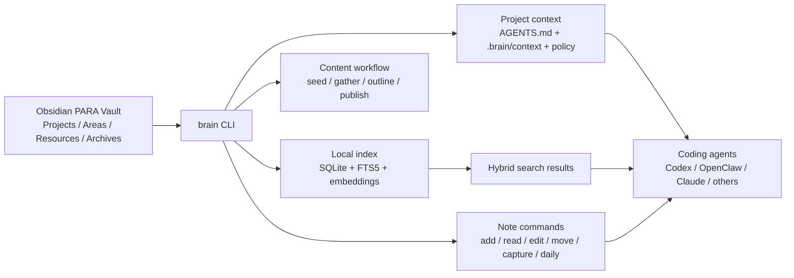
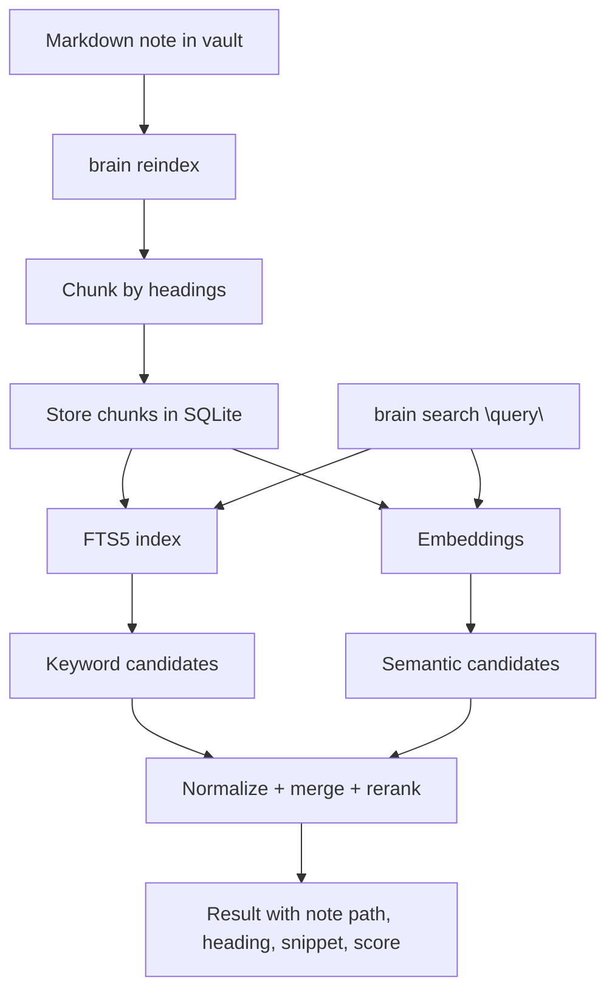
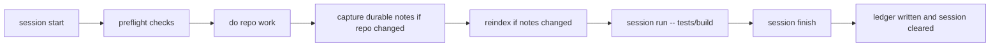

# brain

`brain` is a local-first CLI that turns your Obsidian vault into working memory for you and your coding agents.

It does four things:

1. stores knowledge as plain markdown in a PARA vault
2. builds a local search layer on top with SQLite FTS5 and embeddings
3. gives agents safe commands for capture, retrieval, updates, history, and undo
4. adds project-local context and session enforcement so repo work stays accountable

If you want the shortest possible explanation: `brain` is a command line memory system for markdown notes and AI-assisted software work.

## Mental model

You keep your notes in Obsidian-compatible markdown. `brain` indexes and searches them locally. In coding repos, `brain` can also install project context and enforce a session workflow so agents do not just improvise.



## What `brain` is for

- keeping an Obsidian vault useful from the terminal
- finding related notes with both keyword and semantic retrieval
- capturing project decisions and discoveries as durable notes
- giving agents a safe interface instead of raw file edits
- enforcing project workflows when you want stricter control

## What `brain` is not

- a hosted SaaS knowledge base
- a replacement for Obsidian
- a background daemon that watches everything by itself
- a generic vector database

## Core capabilities

- Linux-first, Arch-friendly
- Obsidian-compatible markdown vault as source of truth
- PARA at the top level
- Hybrid retrieval with SQLite FTS5 plus embeddings
- Agent-friendly commands
- Project-local context bundles for coding agents
- Session enforcement with repo-local policy and ledgers
- Backups, history, undo, and diffable organize workflows

## Install

### Build from source

```bash
git clone https://github.com/JimmyMcBride/brain.git
cd brain
go build -o brain .
sudo install -m 0755 brain /usr/local/bin/brain
```

### Go install

```bash
go install .
```

## Quick start

```bash
brain init
brain doctor
brain add "AI Agent Workflow" --section Projects --type project
brain capture "Interesting idea" --body "A short note about retrieval and agents."
brain daily
brain reindex
brain search "retrieval agents"
```

## How it works

`brain` keeps the vault as the source of truth. The database is just a local search index and ledger layer built on top of the markdown files.



## Config

Config lives at `~/.config/brain/config.yaml` by default.

Supported fields:

- `vault_path`
- `data_path`
- `embedding_provider`
- `embedding_model`
- `output_mode`

Environment overrides:

- `BRAIN_VAULT_PATH`
- `BRAIN_DATA_PATH`
- `BRAIN_EMBEDDING_PROVIDER`
- `BRAIN_EMBEDDING_MODEL`
- `BRAIN_OUTPUT_MODE`

## Command examples

```bash
brain add "Client migration" --section Projects --type project
brain read Projects/client-migration.md
brain edit Projects/client-migration.md --set status=active
brain find migration
brain search "vendor rollout plan"
brain move Projects/client-migration.md Archives/
brain history
brain undo
```

## Content workflow

```bash
brain content seed Projects/client-migration.md
brain content gather Projects/client-migration.md -n 5
brain content outline Projects/client-migration.md -n 5
brain content publish Projects/client-migration.md --channel blog --repurpose thread
```

## Skills

```bash
brain skills install --scope global --agent codex
brain skills install --scope local --agent codex --project .
brain skills install --scope both --agent codex --agent claude --project .
brain skills install --scope global --agent openclaw
brain skills install --skill-root /path/to/custom/skills --mode copy
brain context install --project . --agent codex --agent openclaw
brain context refresh --project .
brain session start --project . --task "implement feature"
brain session run --project . -- go test ./...
brain session finish --project .
```

OpenClaw installs are copied into `~/.openclaw/skills/brain` because OpenClaw's managed skill loader does not currently detect symlinked skill directories.

`brain context install` creates a root `AGENTS.md`, a modular `.brain/context` bundle, a generated `.brain/policy.yaml`, and thin agent-specific wrappers so coding agents can follow a consistent project contract.

## Sessions

Use sessions when you want hard enforcement instead of best-effort agent obedience:

```bash
brain session start --project . --task "tighten retrieval UX"
brain session validate --project .
brain session run --project . -- go test ./...
brain session run --project . -- go build ./...
brain session finish --project . --summary "completed retrieval update"
```

This writes local-only state under:

- `.brain/session.json`
- `.brain/sessions/`

and uses `.brain/policy.yaml` to enforce:

- required startup contract
- durable note updates for repo changes
- reindex after note changes
- recorded verification commands through `brain session run`



## Example vault structure

```text
vault/
  Projects/
    ai-agent-workflow.md
  Areas/
    Daily/
      2026/
        2026-04-09.md
  Resources/
    Captures/
      2026/
        04/
          interesting-idea.md
    Content/
      Outlines/
        ai-agent-workflow-outline.md
  Archives/
```

## Example search queries

```bash
brain search "retrieval agents"
brain search "weekly review"
brain search "publishing workflow"
brain find --type project
```

## Linux setup

1. Install Go and a C toolchain only if you want to build other CGO-based tooling; `brain` itself uses a pure-Go SQLite driver.
2. Build and place `brain` on your `PATH`.
3. Run `brain init` and confirm with `brain doctor`.
4. Point Obsidian at the configured `vault_path`.
5. Run `brain reindex` after meaningful note imports or edits.

## More docs

- [Architecture](docs/architecture.md)
- [Usage](docs/usage.md)
- [Skills](docs/skills.md)
- [Why](docs/why.md)
