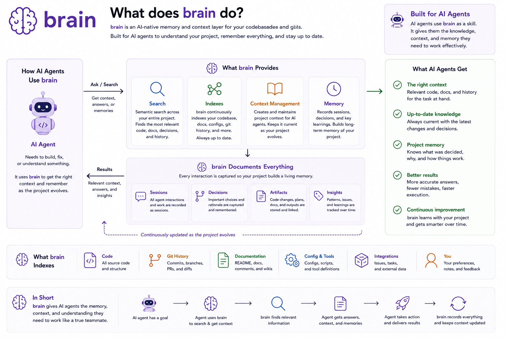

# 🧠 brain



## Give Your AI Coding Agent A Real Brain Inside The Repo

`brain` is a local-first context, memory, retrieval, and workflow platform for AI
coding agents.

It gives every project a durable operating memory inside the repo so the agent stops starting from scratch, stops wasting turns rediscovering context, and works more reliably as the codebase evolves.

- Durable project memory in plain markdown
- Compiled startup context with packet budgets and session reuse
- Local retrieval backed by project-local SQLite
- Session enforcement for verification and durable updates
- Note history and undo for Brain-managed markdown

## The Problem

AI coding agents are powerful, but they are stateless by default.

That usually means:

- repeated prompting just to restore project context
- stale assumptions about architecture and product decisions
- extra tokens spent rediscovering what the repo already knows
- weak continuity across sessions, branches, and feature work
- too much context living in chat history instead of the repo

`brain` fixes that by making the project itself the memory system.

## Who This Is For

`brain` fits best when:

- you use an AI coding agent regularly on a real, evolving codebase
- you want repo-local context instead of depending on chat history
- you want retrieval, compiled context, and workflow discipline to live with the code
- you want Brain to stay focused on memory and execution context instead of trying to own every part of software delivery

## What Brain Actually Does

`brain` keeps agent-readable project docs at the repo root, machine-managed context under `.brain/`, and a local SQLite index for durable project knowledge.

It provides explicit workflows for:

- project contracts and docs
- local retrieval
- compiled task context
- context maintenance audits
- session enforcement
- note history and undo
- promotion-style distillation from active work sessions

This is not another hosted dashboard, cloud vector database, or issue tracker. It lives with the project and is built specifically to help coding agents stay grounded in local truth.

## Mental Model

Every project gets its own Brain:

```text
my-project/
  AGENTS.md
  docs/
  .brain/
    context/
    resources/
    sessions/
    state/
```

- `AGENTS.md` is the root contract for AI agents.
- `docs/` is the agent-readable project documentation layer.
- `.brain/context/` is the generated modular context bundle.
- `.brain/resources/` holds durable references, captures, and change history.
- `.brain/sessions/` holds recorded session ledgers and is local runtime state.
- `.brain/state/` holds SQLite, history logs, backups, and other local state.

Brain ignores `.brain/session.json`, `.brain/sessions/`, `.brain/state/`, and `.brain/policy.override.yaml` from Git by default. The durable shared layer is the markdown/docs surface, not the raw runtime trace.

## Install

### One-line install

Unix shell:

```bash
curl -fsSL https://raw.githubusercontent.com/JimmyMcBride/brain/main/scripts/install.sh | sh
```

Windows PowerShell:

```powershell
irm https://raw.githubusercontent.com/JimmyMcBride/brain/main/scripts/install.ps1 | iex
```

These installers verify published checksums, support `linux`, `darwin`, and `windows` on `amd64` and `arm64`, and install by default to:

- Unix: `~/.local/bin/brain`
- Windows: `%LocalAppData%\Programs\brain\brain.exe`

Stable GitHub releases are published from `main`. Prefer PR merges into `develop` for routine work, then promote official releases from `release/vX.Y.Z` into `main` and install from the latest release published there.

If no GitHub release exists yet, the installer falls back to downloading the current `main` source archive from GitHub and building it locally with Go.

When you upgrade an older Brain repo, `brain update --project .` or `brain context migrate --project .` may refresh `.gitignore` and remove legacy tracked runtime files from the Git index while keeping them on disk. Brain prints what changed so you can review and commit the diff yourself.

If an older Brain-managed `AGENTS.md` does not include Karpathy Guidelines, `brain update --project .` tells the AI agent to ask whether you want them added. The agent records the answer with `brain context guidance karpathy --accept --project .` or `brain context guidance karpathy --decline --project .`, and Brain will not ask again unless you explicitly change the decision later.

### Build from source

Unix shell:

```bash
git clone https://github.com/JimmyMcBride/brain.git
cd brain
go build -o brain .
install -Dm0755 brain ~/.local/bin/brain
```

Windows PowerShell:

```powershell
git clone https://github.com/JimmyMcBride/brain.git
cd brain
go build -o brain.exe .
New-Item -ItemType Directory -Force -Path "$env:LOCALAPPDATA\Programs\brain" | Out-Null
Copy-Item .\brain.exe "$env:LOCALAPPDATA\Programs\brain\brain.exe" -Force
```

## Install The Brain Skill

Add the Brain skill to your machine:

```bash
brain skills install --scope global --agent codex
brain skills install --scope global --agent claude
brain skills install --scope global --agent copilot
brain skills install --scope global --agent pi
```

Add the Brain skill to the current project:

```bash
brain skills install --scope local --agent codex --project .
brain skills install --scope local --agent copilot --project .
brain skills install --scope local --agent pi --project .
```

Preview the target paths first:

```bash
brain skills targets --scope both --agent codex --agent claude --agent copilot --agent pi --project .
```

## Quick Start

In any project directory:

```bash
brain init --project .
brain doctor --project .
brain context install --project .
brain context audit --project .
brain prep --project . --task "tighten auth flow"
brain search --project . "tighten auth flow"
brain session run --project . -- go test ./...
brain session finish --project . --summary "auth flow tightened"
```

Use `brain adopt --project .` instead of `brain init --project .` when the repo already has docs or an unmanaged `AGENTS.md`. After adoption, the AI agent should treat the generated files as starter context, scan the repo deeply, and update AGENTS.md, docs, or `.brain` notes with durable project-specific findings.

As the repo evolves, use `brain context audit --project .` to review whether Brain markdown still covers architecture, config, CI, deploy, test, and docs surfaces. Add `--proposal` when the findings should become a reviewed `.brain/resources/changes/...` note for the agent to apply.

## Optional Modules

Brain is defining a staged module framework so teams can add domain workflows
without making them part of every installation.

Planning is the first official optional module. It is not implemented in Brain
yet. The standalone [`plan`](https://github.com/JimmyMcBride/plan) product remains
the reference implementation and compatibility source while Brain gains module
infrastructure and Planning migrates in controlled phases.

The approved direction:

- Brain Core remains fully useful with Planning disabled.
- Official modules begin as compiled Go packages behind controlled interfaces.
- Future community modules run as external processes over a versioned protocol.
- Local Planning initially retains compatible `.plan/` storage.
- GitHub Planning support is transitional; official Linear support will retire.
- Planning can propose Brain memory updates but cannot silently write them.

See [Module Overview](docs/modules/overview.md),
[Planning Vision](docs/planning/vision.md), and
[Implementation Roadmap](docs/planning/implementation-roadmap.md).

## What Brain Does Not Try To Be

Brain Core intentionally stays focused on context, memory, retrieval, and
workflow foundations. Optional modules can add domain behavior without turning it
into a Core requirement.

Core does not require:

- Planning or a specific issue tracker
- GitHub, Linear, Jira, or another external service
- hosted infrastructure for local workflows
- one universal delivery process

Teams may use Brain without Planning and keep their existing planning systems.

## Main Commands

- `brain init`: bootstrap a project-local Brain workspace
- `brain adopt`: adopt an existing repo into the Brain-managed context model
- `brain doctor`: validate local Brain setup
- `brain prep`: start or reuse a session and compile the first task packet
- `brain read`, `brain edit`: inspect and update managed markdown
- `brain find`, `brain search`: project-local retrieval
- `brain context ...`: install, refresh, compile, inspect, audit, analyze task context, and record optional guidance decisions
- `brain distill --session`: create a reviewed distillation proposal from active session work
- `brain session ...`: enforce workflow and verification rules
- `brain skills ...`: install the Brain skill for agent runtimes
- `brain history`, `brain undo`: inspect and revert tracked note changes
- `brain version`, `brain update`: inspect or update the CLI

## Deep Dives

- [Usage](docs/usage.md)
- [Architecture](docs/architecture.md)
- [Modules](docs/modules/overview.md)
- [Planning](docs/planning/vision.md)
- [Architecture Decisions](docs/adr/README.md)
- [Skills](docs/skills.md)
- [Why](docs/why.md)
