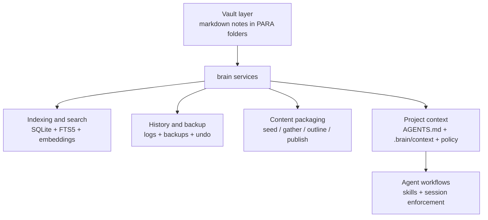
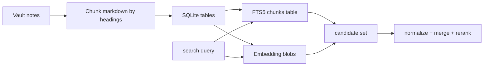
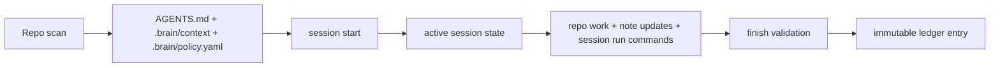

# Architecture

`docs/architecture.md` explains how `brain` is built. It is for contributors and anyone who wants to understand the internal model.

Read [`../README.md`](../README.md) first for the product overview. Read [`usage.md`](usage.md) if you want command workflows instead of internals.

## System shape

At a high level, `brain` is a markdown-first system with three layers:

1. the vault layer where notes live as plain files
2. the local service layer where indexing, history, content, and policy logic run
3. the agent layer where skills, project context, and sessions shape repo behavior

## Package map

- `internal/config`: XDG-aware config loading plus env overrides
- `internal/vault`: vault validation, PARA scaffolding, markdown walking, and path resolution
- `internal/notes`: note model, YAML frontmatter handling, templates, and file operations
- `internal/index`: SQLite schema, FTS5 virtual table, markdown chunking, embedding storage
- `internal/search`: hybrid ranking over FTS and vector similarity
- `internal/history`: append-only logs and undo orchestration
- `internal/backup`: pre-change file backups
- `internal/content`: note-to-content workflow helpers
- `internal/projectcontext`: project context generation, wrappers, managed file updates, policy generation
- `internal/session`: active session state, ledger writing, preflight, and closeout validation
- `internal/skills`: skill installation into global or local agent roots

## Data flow

### Vault and retrieval

`brain` treats markdown in the vault as the source of truth. Reindexing produces a local search layer; it does not replace the files.

### Project context and sessions

Repo-local context is generated from deterministic repo facts. Sessions add enforcement on top of that context.

## Retrieval model

The hybrid retrieval path is intentionally simple and inspectable:

1. parse notes from the vault
2. split markdown by headings
3. store chunks in SQLite
4. mirror chunk text into FTS5
5. generate embeddings for chunks
6. search lexical and semantic candidates separately
7. normalize and merge scores into a final ranking

The default embedder is `localhash`, which keeps the tool usable offline. `openai` is supported when better semantic retrieval matters more than strict local-only operation.

## Safety model

`brain` avoids direct unsafe mutation patterns by default:

- note-changing operations can create backups first
- changes are logged into append-only history
- undo uses stored backups and operation metadata
- organize flows support dry-run behavior
- session enforcement can require durable note updates and explicit verification commands

## Project-context model

Project context is split deliberately:

- `AGENTS.md`: the root contract for the repo
- `.brain/context/*`: modular agent-readable project context
- `.brain/policy.yaml`: machine-readable enforcement policy
- agent wrappers such as `.codex/AGENTS.md` or `.claude/CLAUDE.md`: thin pointers back to the root contract

Generated files are brain-managed through markers or whole-file ownership so refreshes stay deterministic while leaving room for local notes outside managed sections.

## PARA model

`brain` keeps the top level intentionally narrow:

- `Projects/`: active outcomes with an end state
- `Areas/`: ongoing responsibilities and recurring context
- `Resources/`: reference material, captures, lessons, and content packages
- `Archives/`: inactive material retained for history

Richer structure belongs below those folders, not beside them.
